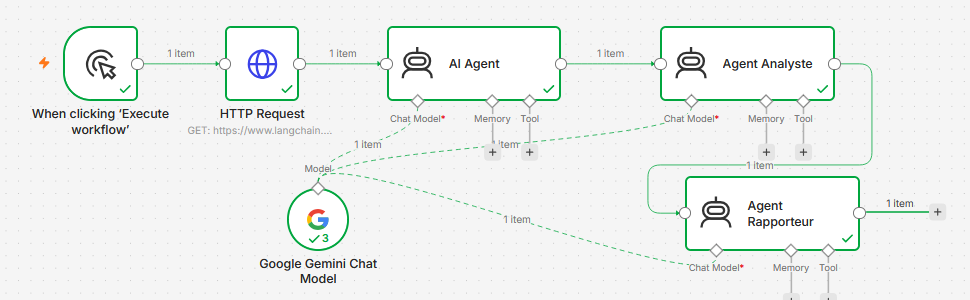

# Projet : Assistant de Veille Technologique & Stratégique IA

## Description

Ce projet est un système multi-agents développé avec **n8n** et **Gemini AI**.
Le système collecte automatiquement des informations web sur les frameworks d'intelligence artificielle puis génère une analyse stratégique complète.

Projet réalisé dans le cadre du module **IA distribuée et systèmes multi-agents** (2025 – 2026).

## Architecture

```
HTTP Request
   → AI Agent Collecteur
   → Agent Analyste
   → Agent Rapporteur
```

Les trois agents partagent le même modèle **Google Gemini Chat Model**.
Chaque agent reçoit la sortie de l'agent précédent via l'expression `{{ $json.output }}`.



## Fonctionnalités

- Collecte automatique des données web
- Analyse stratégique IA
- Génération automatique de rapport
- Architecture multi-agents
- Orchestration avec n8n
- Utilisation de Gemini API

## Technologies utilisées

- n8n
- Gemini AI
- HTTP Request
- Workflow Automation

## Structure du dépôt

```
├── README.md
├── LEARNING_LOG.md
├── Captures/
│   └── workflow_n8n.png      # Exécution réussie du workflow
├── Source/
│   ├── My workflow.json      # Workflow n8n à importer
│   └── prompt_agents.txt     # Prompts des 3 agents
└── Docs/
    └── Rapport_Veille_Technologique_SMA.pdf
```

## Exécution du projet

1. Lancer Docker Desktop
2. Ouvrir n8n : http://localhost:5678
3. Importer `Source/My workflow.json` (menu *Import from File*)
4. Configurer un credential **Google Gemini (PaLM) API** avec votre clé et l'associer au node *Google Gemini Chat Model*
5. Exécuter le workflow

## Auteurs

- Aya QABIL
- Loubna RHOUFAL

Encadrant : Pr. Hasnâa CHAABI
